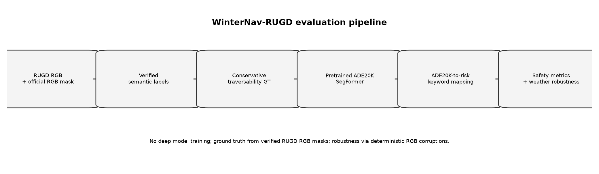
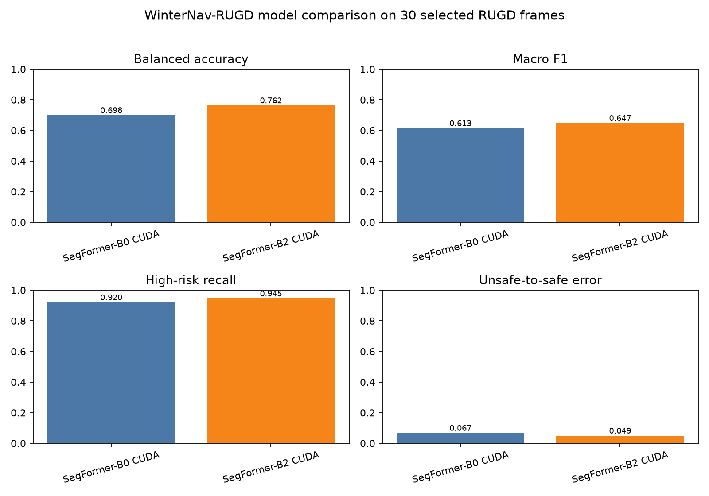
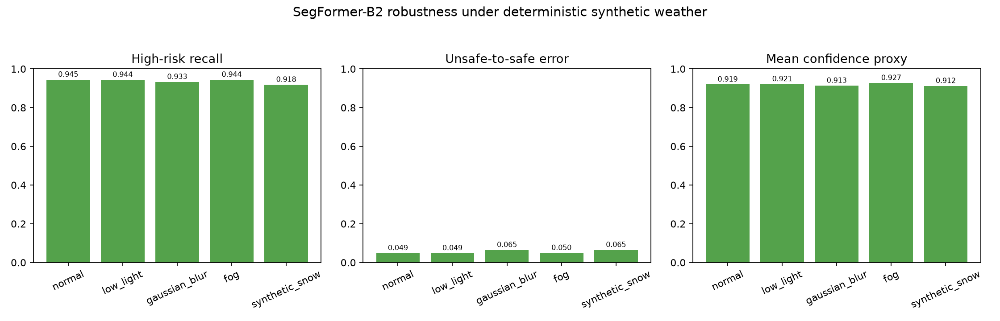
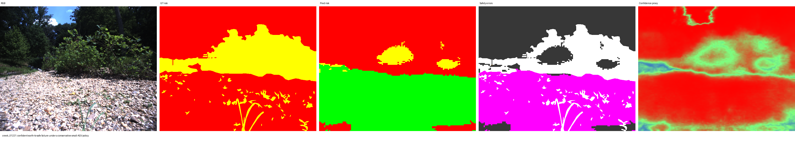

# WinterNav-RUGD

https://github.com/user-attachments/assets/ab1ebfa4-7853-40aa-82af-8a5c4be7aaf6

> **Safety-oriented traversability mapping for small autonomous ground vehicles using off-road robot-view images.**

WinterNav-RUGD is a research prototype that converts official RUGD semantic annotations into conservative robot-specific terrain-risk maps and evaluates zero-shot pretrained semantic-segmentation models on off-road terrain.

The project studies a key robotics question:

> Can a generic pretrained vision model reliably distinguish terrain that is likely safe, uncertain, or unsafe for a small autonomous ground vehicle?

**Risk classes**

| Risk level     | Meaning                           | Robot action        |
| -------------- | --------------------------------- | ------------------- |
| 🟢 Low risk    | Likely traversable terrain        | Continue            |
| 🟡 Medium risk | Rough or uncertain terrain        | Slow down / inspect |
| 🔴 High risk   | Obstacle or likely unsafe terrain | Stop / reroute      |

> No deep model training is performed. All segmentation models are evaluated in a zero-shot transfer setting.

---

## Highlights

- Uses the **RUGD off-road robot dataset** with verified RGB semantic masks.
- Converts semantic labels into a conservative small-AGV traversability policy.
- Evaluates zero-shot ADE20K semantic-segmentation models.
- Introduces safety-focused metrics such as **unsafe-to-safe error rate**.
- Compares SegFormer-B0 and SegFormer-B2 on the same fixed RUGD subset.
- Tests robustness under synthetic low light, blur, fog, and snow.
- Identifies confident unsafe-to-safe failure cases caused by generic semantic labels such as `earth`.

---

## Pipeline



```text
RUGD RGB frame + official RGB semantic mask
                    ↓
Verified RUGD semantic labels
                    ↓
Conservative small-AGV traversability policy
                    ↓
Ground-truth risk map: low / medium / high
                    ↓
Pretrained ADE20K segmentation model
                    ↓
ADE20K semantic labels → robot-risk mapping
                    ↓
Safety metrics, failure analysis, and weather robustness evaluation
```

---

## Dataset

This project uses the **Robot Unstructured Ground Driving Dataset (RUGD)**.

The full dataset contains robot-view off-road RGB frames and RGB semantic annotation masks.

### Verified dataset facts

- Valid RGB-image / semantic-mask pairs: **5,759**
- Image resolution: **688 × 550**
- Annotation format: **RGB color masks**
- Unknown annotation colors found: **0**
- Dataset labels include dirt, sand, grass, tree, rock-bed, water, sky, vehicle, log, bush, rock, bridge, concrete, and more.

### Required local dataset structure

Extract RUGD under:

```text
data/raw/rugd/
```

Expected paths:

```text
data/raw/rugd/RUGD_frames-with-annotations/RUGD_frames-with-annotations/
data/raw/rugd/RUGD_annotations/RUGD_annotations/
data/raw/rugd/RUGD_annotations/RUGD_annotations/RUGD_annotation-colormap.txt
```

The raw dataset is intentionally excluded from Git.

---

## Conservative Traversability Policy

RUGD provides semantic labels, not robot-specific traversability labels. Therefore, this project defines a conservative policy for a small autonomous ground vehicle.

| Risk           | Example RUGD labels                                                                            |
| -------------- | ---------------------------------------------------------------------------------------------- |
| 🟢 Low risk    | dirt, asphalt, gravel, concrete                                                                |
| 🟡 Medium risk | sand, grass, mulch, bush                                                                       |
| 🔴 High risk   | rock-bed, rock, log, tree, water, sky, vehicle, bicycle, person, fence, bridge, sign, building |

`rock-bed` is intentionally treated as high risk because rough rocky terrain may cause wheel slip, vibration, poor traction, collision, or immobilization for a small ground vehicle.

---

## Hardware

Validated local hardware:

```text
GPU: NVIDIA GeForce RTX 3050 Laptop GPU
VRAM: 4 GB
PyTorch CUDA build: cu126
CUDA available: Yes
```

---

## Installation

Create and activate a Python virtual environment, then install dependencies:

```powershell
python -m venv .venv
.\.venv\Scripts\Activate.ps1
pip install -r requirements.txt
```

Verify CUDA support:

```powershell
.\.venv\Scripts\python.exe -c "import torch; print(torch.cuda.is_available()); print(torch.cuda.get_device_name(0) if torch.cuda.is_available() else 'CPU only')"
```

---

## Quick Start

Run all unit tests:

```powershell
.\.venv\Scripts\python.exe -m unittest discover -s tests
```

Generate a ground-truth traversability map:

```powershell
.\.venv\Scripts\python.exe scripts\run_single_image.py `
  --mode ground_truth `
  --sequence creek `
  --filename creek_00001.png `
  --output_dir outputs/phase1_example
```

Run SegFormer-B2 on a single RUGD frame:

```powershell
.\.venv\Scripts\python.exe scripts\run_single_image.py `
  --mode segformer `
  --model_name segformer_b2 `
  --sequence creek `
  --filename creek_00001.png `
  --output_dir outputs/phase2_segformer
```

---

## Experiments

### Phase 1 — RUGD Ground-Truth Risk Generation

```powershell
.\.venv\Scripts\python.exe scripts\run_single_image.py `
  --mode ground_truth `
  --sequence creek `
  --filename creek_00001.png `
  --output_dir outputs/phase1_example
```

Outputs include:

- Original RUGD RGB frame
- Official semantic annotation
- Ground-truth traversability map
- Risk overlay
- Raw `0 / 1 / 2` risk mask

---

### Phase 2–4 — Zero-Shot Model Evaluation

SegFormer-B0:

```powershell
.\.venv\Scripts\python.exe scripts\run_subset_experiment.py `
  --mode segformer_eval `
  --model_name segformer_b0 `
  --subset_size 30 `
  --seed 42 `
  --output_dir outputs/phase4_segformer_b0_cuda
```

SegFormer-B2:

```powershell
.\.venv\Scripts\python.exe scripts\run_subset_experiment.py `
  --mode segformer_eval `
  --model_name segformer_b2 `
  --subset_size 30 `
  --seed 42 `
  --output_dir outputs/phase4_segformer_b2
```

---

### Phase 5 — Weather Robustness

```powershell
.\.venv\Scripts\python.exe scripts\run_subset_experiment.py `
  --mode weather_eval `
  --model_name segformer_b2 `
  --subset_size 30 `
  --seed 42 `
  --output_dir outputs/phase5_weather_b2
```

The experiment evaluates:

- Normal condition
- Low light
- Gaussian blur
- Fog
- Synthetic snow

> These are deterministic image-space corruptions, not physical Finnish winter weather simulations.

---

## Main Results

### Normal-condition evaluation on a fixed 30-image RUGD subset

| Model            |   Device |   Accuracy | Balanced Accuracy |   Macro F1 | High-Risk Recall | Unsafe-to-Safe Error | Runtime / Image |
| ---------------- | -------: | ---------: | ----------------: | ---------: | ---------------: | -------------------: | --------------: |
| SegFormer-B0     |     CUDA |     0.7174 |            0.6983 |     0.6130 |           0.9196 |               0.0665 |        1.0238 s |
| **SegFormer-B2** | **CUDA** | **0.7455** |        **0.7620** | **0.6467** |       **0.9446** |           **0.0487** |    **0.9210 s** |

SegFormer-B2 was selected as the main model because it improved balanced accuracy, macro F1, high-risk recall, and safety performance while remaining practical on a 4 GB laptop GPU.



---

## Weather Robustness: SegFormer-B2

| Condition      | Accuracy | Balanced Accuracy | Macro F1 | High-Risk Recall | Unsafe-to-Safe Error | Mean Confidence Proxy |
| -------------- | -------: | ----------------: | -------: | ---------------: | -------------------: | --------------------: |
| Normal         |   0.7455 |            0.7620 |   0.6467 |           0.9446 |               0.0487 |                0.9195 |
| Low light      |   0.7402 |            0.7566 |   0.6399 |           0.9437 |               0.0485 |                0.9213 |
| Gaussian blur  |   0.7198 |            0.7430 |   0.6176 |           0.9329 |               0.0648 |                0.9134 |
| Fog            |   0.7351 |            0.7526 |   0.6333 |           0.9441 |               0.0496 |                0.9274 |
| Synthetic snow |   0.7012 |            0.6648 |   0.5888 |           0.9184 |               0.0651 |                0.9121 |

Synthetic snow and Gaussian blur caused the largest increase in safety-critical unsafe-to-safe errors.



---

## Safety Failure Analysis

The project found that average performance alone can hide severe safety failures.

In difficult creek scenes, rough rocky terrain was sometimes predicted as generic ADE20K `earth`. Because the generic semantic policy maps `earth` to low risk, the system can produce confident unsafe-to-safe errors.

Example finding:

```text
Average unsafe-to-safe error, SegFormer-B2: 4.87%
Worst single-frame unsafe-to-safe error, SegFormer-B0: 54.71%
```

> Maximum softmax confidence is not sufficient for reliable risk awareness: the model can be confidently wrong.



---

## Metrics

| Metric                 | Interpretation                                                       |
| ---------------------- | -------------------------------------------------------------------- |
| Accuracy               | Overall pixel-level agreement                                        |
| Balanced Accuracy      | Class-balanced recognition performance                               |
| Macro F1               | Equal-weighted F1 score across low, medium, and high risk            |
| High-Risk Recall       | Percentage of GT high-risk terrain predicted as high risk            |
| Unsafe-to-Safe Error   | GT high-risk terrain predicted as low risk; critical safety failure  |
| Unsafe-to-Medium Error | GT high-risk terrain predicted as medium risk                        |
| Safe-to-High-Risk Rate | GT low-risk terrain predicted as high risk; conservative false alarm |

---

## Reproducibility

The helper script prints the validated experiment commands by default:

```powershell
.\scripts\run_all_validated_experiments.ps1
```

Run the documented experiments with:

```powershell
.\scripts\run_all_validated_experiments.ps1 -Run
```

Mask2Former is intentionally excluded from validated results because its checkpoint load initialized trainable parameters.

UPerNet-ConvNeXt-Tiny is included only as a smoke-test architecture comparison and is not part of the main benchmark.

---

## Project Structure

```text
config/      Label definitions, model registry, risk mappings, experiment settings
src/         Dataset, models, traversability, weather, evaluation, visualization
scripts/     Single-image, subset evaluation, and reproducibility scripts
tests/       Unit tests for mappings, loading, evaluation, weather, and model helpers
figures/     Final project figures
results/     Research summary
outputs/     Generated local experiment outputs
data/        Local RUGD dataset files
```

---

## Limitations

- Segmentation models are zero-shot ADE20K models, creating a domain gap to off-road RUGD terrain.
- Semantic-to-risk conversion is a heuristic conservative policy, not an official RUGD traversability label.
- Synthetic weather is image corruption, not a physical weather, sensor, camera-exposure, or lens simulation.
- Maximum softmax probability is a confidence proxy, not calibrated uncertainty.
- The project does not yet include robot control, path planning, wheel-slip sensing, IMU data, depth sensing, or terrain-dynamics modelling.

---

## Future Work

- Fine-tune segmentation models on off-road terrain labels.
- Add temporal risk smoothing over video sequences.
- Add monocular depth, LiDAR, IMU, wheel-slip, or force sensing.
- Learn robot-specific traversability from vehicle dynamics and terrain interaction.
- Connect predicted risk to speed adaptation, path planning, and stop/reroute control.
- Validate on a real autonomous ground robot in Nordic outdoor conditions.

---
